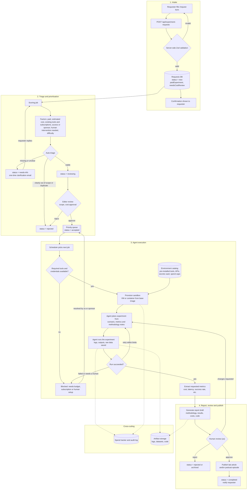

# CTAIO Labs - Request an Experiment

Vite + React + TypeScript frontend for the public `/request` form.
**The backend is a stub** - see `src/api/experimentRequests.ts`.

```bash
npm install
npm run dev        # http://localhost:5173/request
npm test           # vitest (validation, conditional fields, submit, failure, duplicate-submit)
npm run build      # typecheck + production build
```

Try the error state locally: `/request?stub=fail`.
Submitted records land in `localStorage["ctaio.experimentRequests.stub"]`.

## Backend design (planned)


## Wiring the backend later

One function: `submitExperimentRequest(values)` in `src/api/experimentRequests.ts`.
Either set `VITE_EXPERIMENT_API_URL` (the form POSTs the stored record as JSON) or replace the body.
The record it sends is already the shape to persist (`StoredExperimentRequest` in `src/lib/types.ts`):
public fields + `status: "new"` + derived `paidExperiment` (`yes`) and `needsCostReview` (`possibly`).
Re-validate on the server; the client schema in `src/lib/schema.ts` is a good starting point.

## Layout

```
src/lib/options.ts      every option list (one place to edit copy)
src/lib/schema.ts       Zod field rules + costIssues() cross-field rules + RHF resolver
src/lib/mapRequest.ts   form values -> stored record (splits technologies, drops cost fields when unpaid, derives triage flags)
src/lib/triage.ts       "Paid experiment?" filter (any/no/yes/review) + cost formatting for a future admin list
src/components/         fields.tsx, TriageRail.tsx, ExperimentRequestForm.tsx
src/api/                backend stub
```

## Notes

- Hosting needs an SPA fallback so `/request` serves `index.html`.
- "Would you be willing to provide access or sponsor…" stays visible even when the answer to the
  paid question is "No", because the brief lists it as always-optional.
- The `CTAIO Labs` link in the top bar points to `https://ctaio.dev/en/labs`; adjust if that's not the real path.
